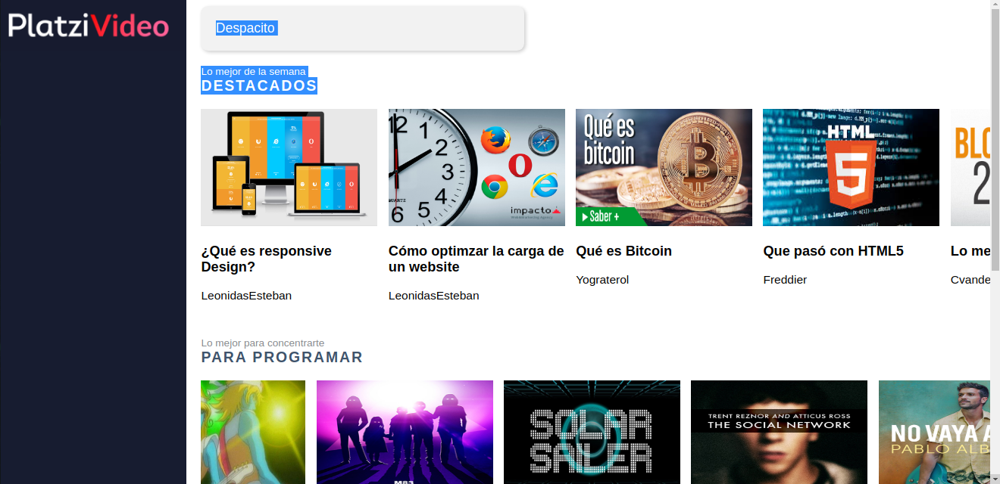

# Video player exercise

*This exercise was finished at 2019, it's a part of platzi's course about React JS. So We used a architecture to create the components, smart and dump components* 

To run this project
------
You use the npm scripts into package file if want to see the project
  

  Home - page/ (container|smart)  
  -> Related - UI  
  -> Categories -UI  
    -> Category -UI  
      -> Playlist - UI  
        -> Media - UI /Pure  
  -> Search / (container|smart)  
  -> Modal - (container-smart)  

#REACT #WEBPACK #CSS #HTML 

